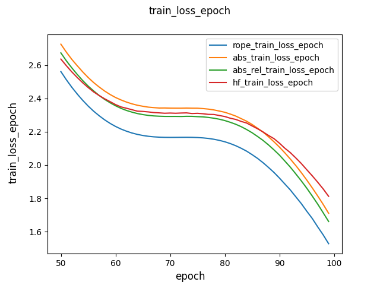
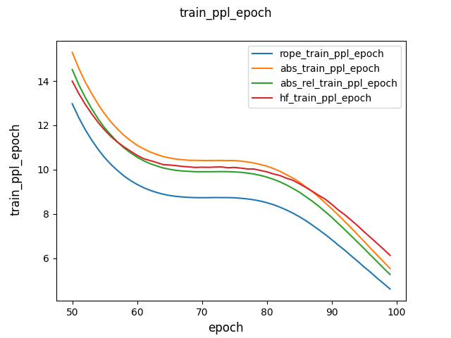
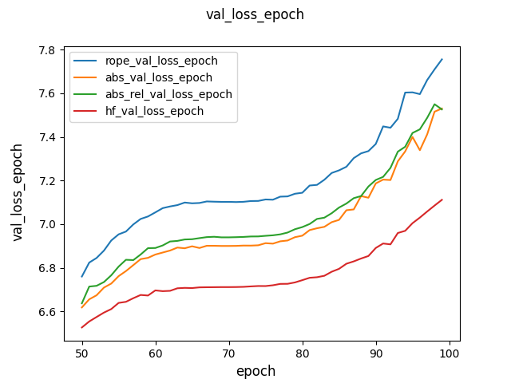
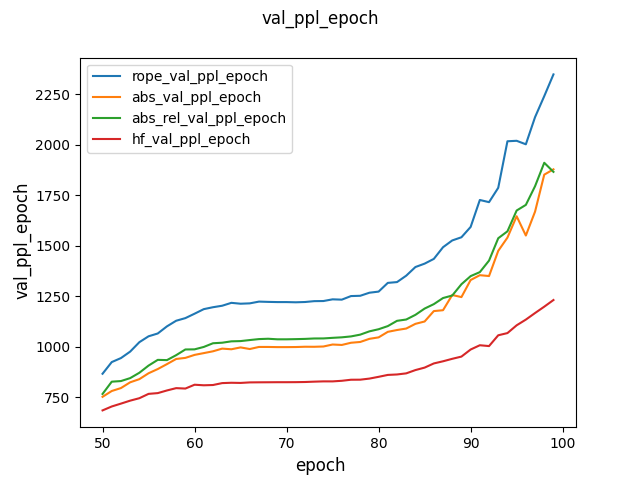

# LLaMA - Large Languare Model Meta AI
**LLaMA** is a family of LLMs developed by Meta with some replacements:
- LayerNorm ⟶ RMSNorm.
- Absolute Position Encodings ⟶ Rotary Position Embeddings.
- Multihead Attention ⟶ Grouped Query Attention.
- ReLU ⟶ SwiGLU.
# About this project
- This is a personal project, for educational purposes only!
- This project is built to compare three position encoding methods: Rotary Position Embeddings, Absolute Position Encodings and Relative Position Encodings. There are four models:
   - Llama_rope: Llama with rotary position embeddings.
   - Llama_abs_rel: Llama with absolute position encoding and relative position encoding (inspired by the AliBi model).
   - Llama_abs: Llama with absolute position encodings.
   - LlamaHF: Llama model from Hugging Face (with RoPE).
# Experiment
1. **Training**
   - Model size: ~33M params.
   - Dataset: [tiny_shakespeare](data/tinyshakespeare.txt).
   - Number of epochs: 100.
   - Platform: Google Colab free (T4 GPU).
2. **Results**
   - Performance on the training phase: Llama_rope > Llama_abs_rel > Llama_abs > LlamaHF.
   - Performance on the validation phase: Llama_rope < Llama_abs_rel < Llama_abs < LlamaHF.
    \
    \
    \
   
3. **Conclusions**
- The 'Rotary Position Embeddings' method gets the best performance.
- Overfitting occurred here. The reasons can be:
  - The dataset is too small (~1M of text). ⟶ Try to use a bigger dataset.
  - The model is too complex. ⟶ Try to use another configuration (decrease d_model, kv_heads, n_layers; increase weight_decay; etc.).
# How to use
1. Clone this repo, cd into llama.
2. Install the requirements: pip install -q -r requirements.txt.
3. Train the tokenizer: run the below command; after that, the pre-trained tokenizer is located in the root directory.
```
python train_tokenizer.py \
--corpus './data/tinyshakespeare.txt' \
--vocab_size 8192 \
--model_name 'tinyshakespeare' \
--model_type 'bpe'
```
4. Train Llama: modify the config file (configs/llama_rope.yaml,...), then run the below command:
```
!python train.py \
--config_file './configs/llama_abs.yaml' \
--max_epochs 100 \
--ckpt_path './results/llama_abs/checkpoints/epoch=49-step=5500.ckpt' # add this line when resume the training
```
# Based on:
https://arxiv.org/abs/2302.13971 \
https://arxiv.org/abs/2307.09288 \
https://arxiv.org/abs/2108.12409 \
https://arxiv.org/abs/2104.09864 \
https://github.com/Meta-Llama/llama \
https://github.com/lucidrains/rotary-embedding-torch \
https://huggingface.co/docs/transformers/main/en/model_doc/llama
